# unified_popups

[](https://pub.dev/packages/unified_popups)
[](https://pub.dev/packages/unified_popups/score)
[](https://pub.dev/packages/unified_popups/score)
[](https://pub.dev/packages/unified_popups/score)
[](https://github.com/xinqingaa/unified_popups/blob/master/LICENSE)

**Languages:** [English](README_EN.md) · [中文](README.md)

**A unified Overlay popup system for Flutter**: Toast / Loading / Confirm / Date /
Sheet / FlowSheet / Menu / DropMenu / Custom — **one runtime, one conflict &
lifecycle model, one back-button and route policy**.

No `BuildContext` required. Does not pollute the page route stack. Call from
Services, network callbacks, or ViewModels.

```dart
Pop.xxx(Config) -> PopupOpenResult<T>
```

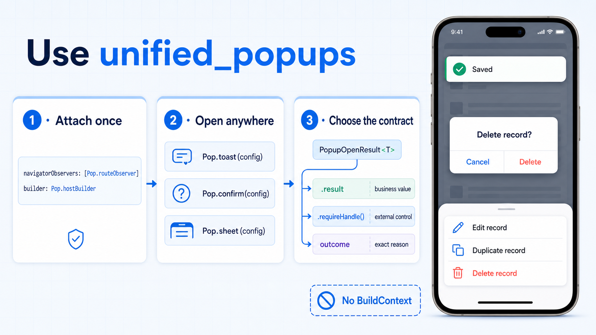

## Why this package

Official `showDialog` / `showModalBottomSheet` answer “how do I show a Material
widget?” Real apps also need:

| Pain point | unified_popups |
| --- | --- |
| No `BuildContext` in Services / async callbacks | Global `Pop.*`, no Context plumbing |
| Separate Toast / Loading / Confirm / Sheet stacks | One open model with configurable policies |
| Popups pushed onto Navigator, messy back stack | Private Overlay; page routes stay clean |
| Inconsistent back / swipe / route-change behavior | Shared `backPolicy` / `routePolicy` |
| Duplicate Loading, messy multi-step flows | Key conflict policies + FlowSheet page stack |

In short: **official APIs are page-level route popups; this package is
app-level popup governance.** See [Why Overlay](doc/WHY_OVERLAY.md)
(Chinese).

## Capabilities · when to use which

| API | Typical use | Default system back |
| --- | --- | --- |
| **Toast** | Success / error / light feedback without interrupting | Ignore (does not intercept) |
| **Loading** | Submit, upload, fetch wait states | Block (prevent accidental exit) |
| **Confirm** | Delete, discard edits, second confirmation | Block (must tap a button) |
| **Date** | Birthday, booking date, etc. | Dismiss popup |
| **Sheet** | Option lists, filters, single-page forms | Dismiss popup |
| **FlowSheet** | Multi-step wizards (nested page stack) | Pop inner page first, then close sheet |
| **Menu** | Anchor “more” custom menus | Dismiss popup |
| **DropMenu** | Filter bars, settings rows, nestable sections | Dismiss popup |
| **Custom** | Any content on the shared lifecycle | Configurable |

## Preview

Screenshots from the Example app (FitPulse / API Lab).

### Toast · light feedback

Saved, network error, copied — without interrupting the current page.

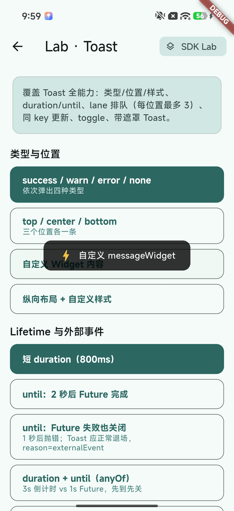

### Loading · async wait

Submit, upload, payment fetch. Use `PopupLifetime.until` to dismiss when a
Future settles.

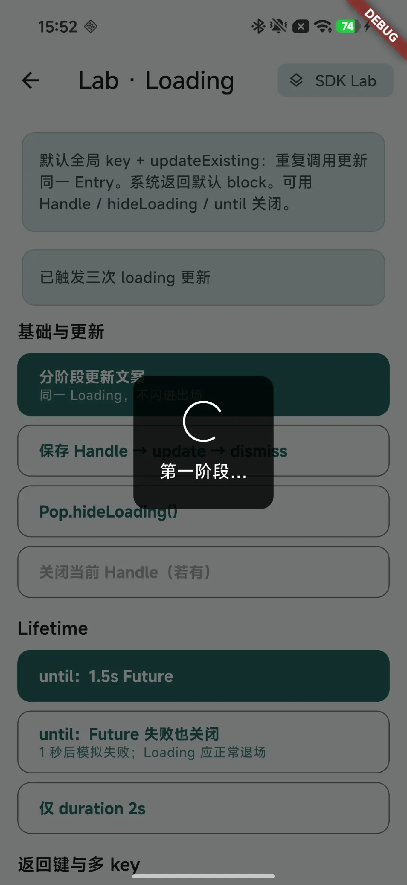

### Confirm · strong confirmation

Delete, clear, leave unsaved work — barrier tap and system back do not dismiss
by default.

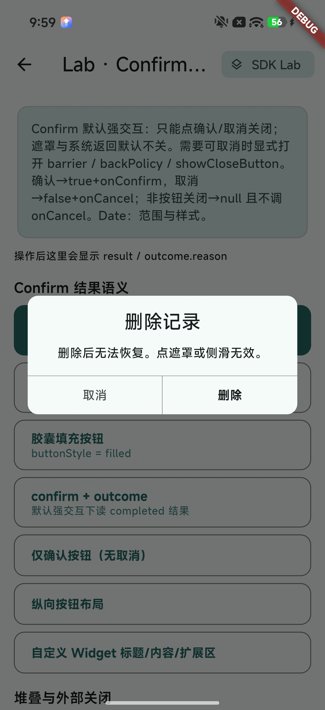

### Sheet · single panel

Option lists, filters, simple forms. Stack Confirm on top for in-panel
confirmation.

| Sheet | Sheet + Confirm |
| :---: | :---: |
| 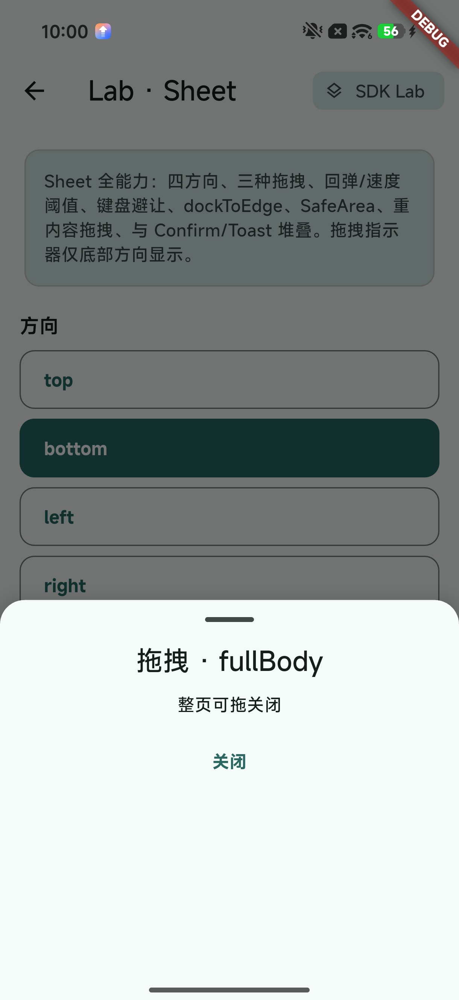 | 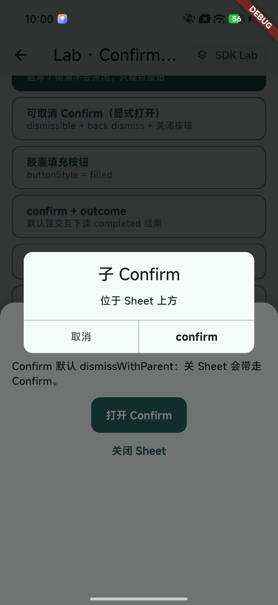 |

### FlowSheet · multi-step flow

Wizards and multi-page forms: system back pops inner pages first, then closes
the sheet. Use `popToRoot` to return to the root page without closing the sheet.
A Confirm on top can still block back.

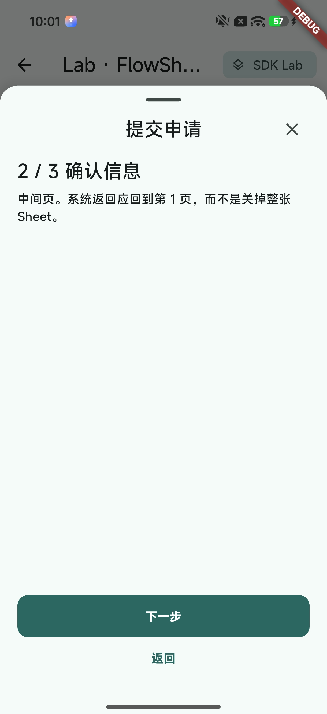

### DropMenu · anchored menu

One-level filter menus, or nestable settings sections (including liquid-glass
style).

| Single level | Nested sections |
| :---: | :---: |
| 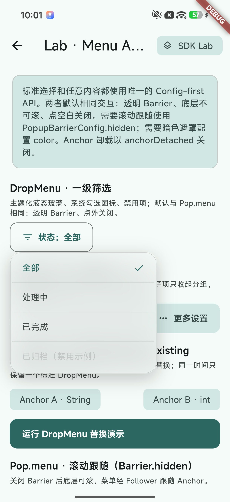 | 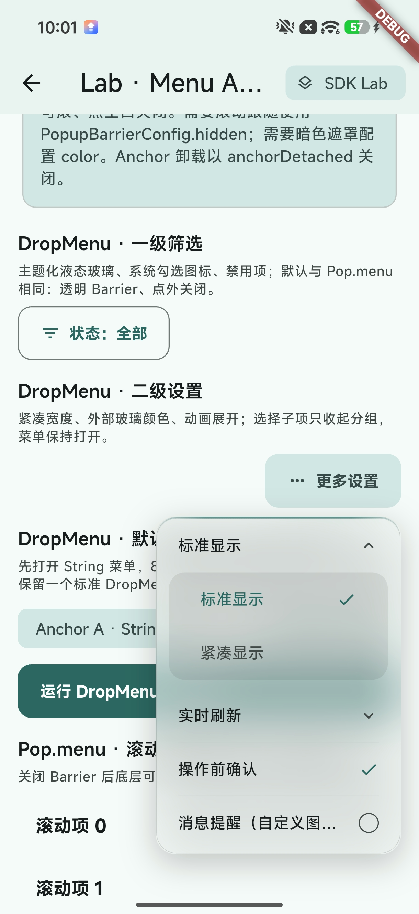 |

## Quick start (30 seconds)

```yaml
dependencies:
  unified_popups: ^2.0.6
```

```dart
MaterialApp(
  navigatorObservers: [Pop.routeObserver],
  builder: Pop.hostBuilder,
  home: const HomePage(),
);
```

Calls made before the first Host mount are queued and shown when Host is ready.

```dart
Pop.toast(const ToastConfig.text('Saved', type: ToastType.success));

Pop.loading(const LoadingConfig.text('Submitting'));
try {
  await submit();
} finally {
  Pop.dismissChannel(PopupChannel.loading);
}

final ok = await Pop.confirm(
  const ConfirmConfig(
    title: 'Delete record',
    content: 'This cannot be undone.',
    confirmAction: ConfirmAction.text('Delete'),
    cancelAction: ConfirmAction.text('Cancel'),
  ),
).result;
```

## Architecture

Business code, Services, and network callbacks all enter the same Runtime via
`Pop.xxx(Config)`. Popups render on a private Overlay above the app child and
do not pollute the page route stack.

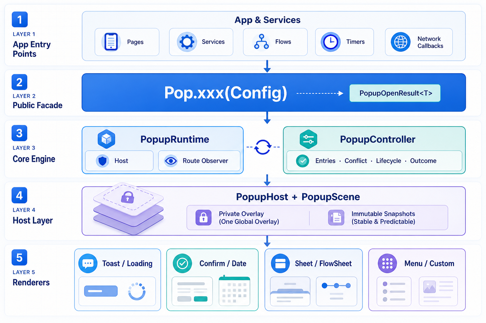

Layering and the back bridge: [Architecture](doc/ARCHITECTURE.md) (Chinese).
Trade-offs vs official Dialog / Sheet: [Why Overlay](doc/WHY_OVERLAY.md)
(Chinese).

## Lifecycle

Every entry shares one state machine from `created` to `disposed`. Conflict
policy decides stack, reject, replace, or in-place update. Dismiss may come
from complete / manual / back / barrier / route / lifetime. The first dismiss
request settles `result` / `outcome`; `dismissed` completes after the exit
animation. Later dismiss calls are idempotent.

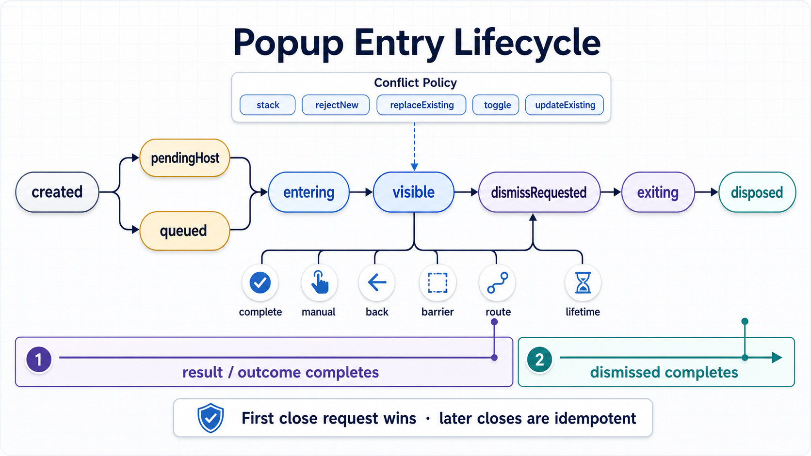

## Understand the return model first

`Pop.xxx(config)` is synchronous and always returns `PopupOpenResult<T>`.
`await` does not choose between a value and a Handle — what you read from
`PopupOpenResult` does.

| Goal | Call | You get |
| --- | --- | --- |
| Fire and forget | `Pop.toast(config)` | Ignore the open decision |
| Wait for a business value | `await Pop.confirm(config).result` | `bool?` |
| Imperative control | `Pop.loading(config).requireHandle()` | `PopupHandle<void>` |
| Handle conflicts | `final opened = Pop.menu(config)` | `PopupOpenResult<T>` |

```text
Pop.confirm(config)
        │
        ▼
PopupOpenResult<bool>
   ├─ .result ──────────> Future<bool?>
   ├─ .requireHandle() ─> PopupHandle<bool>
   ├─ .handleOrNull ────> PopupHandle<bool>?
   └─ switch ───────────> opened / updated / rejected / toggled
```

Business result:

```dart
final confirmed = await Pop.confirm(
  const ConfirmConfig(
    title: 'Delete record',
    content: 'This cannot be undone.',
    confirmAction: ConfirmAction.text('Delete'),
    cancelAction: ConfirmAction.text('Cancel'),
  ),
).result;
```

Imperative control:

```dart
final handle = Pop.loading(
  const LoadingConfig.text('Uploading'),
).requireHandle();

await handle.dismiss();
```

`.result` is convenient but lossy: cancel, external dismiss, conflict reject, or
toggle may all yield `null`. Read `handle.outcome` for the exact reason. When
conflicts are expected, use `handleOrNull` instead of `requireHandle()` (which
may throw `StateError`).

## Prefer an app-level facade

SDK Configs expose full power. Real apps usually want shared visuals, copy,
analytics, error handling, and defaults. Have business pages call your own
`AppPop`:

```dart
abstract final class AppPop {
  static void success(String message) {
    Pop.toast(
      ToastConfig.text(message, type: ToastType.success),
    );
  }

  static Future<bool> confirm({
    required String title,
    required String content,
  }) async {
    return await Pop.confirm(
          ConfirmConfig(
            title: title,
            content: content,
            confirmAction: const ConfirmAction.text('OK'),
            cancelAction: const ConfirmAction.text('Cancel'),
          ),
        ).result ??
        false;
  }
}
```

Usage:

```dart
final confirmed = await AppPop.confirm(
  title: 'Delete record',
  content: 'This cannot be undone',
);
```

In the Example, FitPulse uses `AppPop`; the API Lab keeps raw `Pop.xxx(Config)`
to show product wrapping vs the full SDK contract.

## Builder Handle

Sheet, Menu, and Custom builders receive a Handle automatically — no
`requireHandle()`:

```dart
final selected = await Pop.sheet<String>(
  SheetConfig<String>(
    builder: (context, handle) => Column(
      children: [
        ListTile(
          title: const Text('Copy'),
          onTap: () => handle.complete('copy'),
        ),
        TextButton(
          onPressed: handle.dismiss,
          child: const Text('Cancel'),
        ),
      ],
    ),
  ),
).result;
```

- `complete(value)`: finish with a business result.
- `dismiss()`: cancel / close with no result.
- `result`: nullable value only.
- `outcome`: value plus exact `PopupDismissReason`.
- `dismissed`: completes after exit animation and visual removal.

## Loading and `until`

Loading payloads are mutually exclusive constructors:

```dart
const LoadingConfig.indicator();
const LoadingConfig.text('Submitting');
const LoadingConfig.content(MyLoadingContent());
```

`PopupLifetime.until` dismisses when the Future settles (success or failure).
Business errors remain the caller’s responsibility:

```dart
final request = saveData();

Pop.loading(
  LoadingConfig.text(
    'Saving',
    lifetime: PopupLifetime.until(request),
  ),
);

await request;
```

Default Loading uses a global key with `updateExisting`, so repeated calls
update the same entry and handle.

## Menu and DropMenu

```dart
final anchor = PopupAnchorController();

PopupAnchor(
  controller: anchor,
  child: IconButton(
    icon: const Icon(Icons.more_horiz),
    onPressed: () async {
      final action = await Pop.menu<String>(
        MenuConfig<String>(
          anchor: anchor,
          builder: (context, handle) => ListTile(
            title: const Text('Edit'),
            onTap: () => handle.complete('edit'),
          ),
        ),
      ).result;
    },
  ),
);
```

Menu defaults to a transparent tap/drag-to-dismiss barrier
(`dismissOnDrag: true`) that also blocks underlying scroll. Pass
`PopupBarrierConfig.hidden()` only when the page must keep scrolling while the
menu follows its anchor.

DropMenu uses `DropMenu.single` or `DropMenu.nested`. Standard DropMenu
defaults to global `replaceExisting`.

## Batch dismiss

```dart
await Pop.dismissTop();
await Pop.dismissChannel(PopupChannel.sheet);
await Pop.dismissTags({'network'});
await Pop.dismissAll();
```

`PopupBehaviorConfig` channel is fixed per capability. Apps configure key,
tags, conflict, route, and back policies. To clear a key on an existing
behavior, use `copyWith(clearKey: true)`.

## Docs

Deep-dive docs are currently Chinese; use them alongside this English README:

- [Consumer usage skill](skills/unified-popups-usage/SKILL.md) — wrap in AppPop, read docs on demand, do not guess APIs
- [Why Overlay instead of official Dialog / Sheet](doc/WHY_OVERLAY.md)
- [Architecture](doc/ARCHITECTURE.md)
- [Full API reference](doc/API_REFERENCE.md)
- [v1 → v2 migration](doc/MIGRATION_V1_TO_V2.md)

Run the Example:

```bash
cd example
flutter run
```
